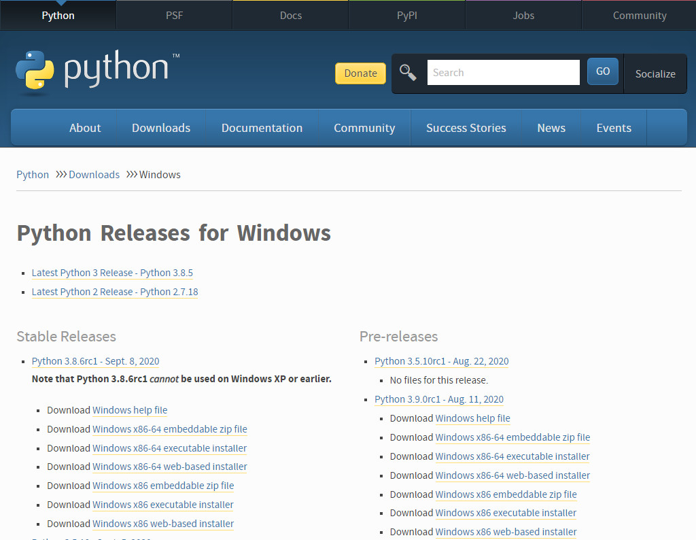

## Python3 安装
    python是一种面向对象的解释型计算机程序设计语言，由荷兰人Guido van Rossum(吉多 范 罗苏姆）于1989年发明，第一个公开发行版发行于1991年。
    Python是一门跨平台、开源、免费的解释型高级动态编程语言，支持伪编译将Python源程序转换为字节码来优化程序和提高运行速度，支持使用py2exe、pyinstaller或cx_Freeze工具将Python程序转换为二进制可执行文件。
    Python支持命令式编程（How to do）、函数式编程（What to do），完全支持面向对象程序设计，语法简洁清晰，拥有大量的几乎支持所有领域应用开发的成熟扩展库。
    胶水语言：可以把多种不同语言编写的程序融合到一起实现无缝拼接，更好地发挥不同语言和工具的优势，满足不同应用领域的需求。
    
### step 1. 选择平台 
    1. Unix & Linux 操作系统上安装
    2. Windows操作系统上安装
    3. MAC操作系统上安装

### step 2. Python下载
    本文使用windows平台进行python的安装
    请到官方网站，下载并查看最新版本并下载，官网下载网址：
    Python官网：https://www.python.org/
    你可以在以下链接中下载 Python 的文档，你可以下载 HTML、PDF 和 PostScript 等格式的文档。
    Python文档下载地址：https://www.python.org/doc/ 
    windows/在下载列表中选择Windows平台安装包，包格式为：python-XYZ.exe 文件 ， XYZ 为你要安装的版本号。
   
    
### step 3. 安装python 
    1）找到python安装文件所在文件夹， 双击下载包，进入 Python 安装向导

    2）只需要使用默认的设置一直点击"下一步"直到安装完成即可。
    一路点击下一步就可以安装完毕, 唯一注意的是，在安装对话是有添加到环境变量(不然得手动的添加) 
### step 4. 测试安装成功
    打开命令窗口并输入python -V，如果出现下面的提示就是安装成功了
```
disk:>python -V
Python 3.7.1
```


## 运行Python
    有三种方式可以运行Python：
    1) 交互式解释器：
    你可以通过命令行窗口进入 Python，并在交互式解释器中开始编写 Python 代码。
    你可以在 Unix、DOS 或任何其他提供了命令行或者 shell 的系统进行 Python 编码工作。
    在windows中打开命令窗口的方式有很多，方法一:使用开始按钮->所有程序->附件->命令提示符
    方法二：按windows键+R在弹出的运行窗口中的打开文本框中输入cmd，无论你用哪种方法打开都可以，在命令提示符下输入python,你就可以在这种交互方式下进行python的编码工作


     2) 命令行脚本
    在你的应用程序中通过引入解释器可以在命令行中执行Python脚本，如下所示：
    disk\path:>python filename.py 
    3) 集成开发环境（IDE：Integrated Development Environment）
    pyCharm
    Eclipse
    Anacoda
    visual studio code

# Python基础
## 基础语法概念

+ 编码

    默认情况下，Python 3源码文件以 UTF-8 编码，所有字符串都是 unicode 字符串。 当然你也可以为源码文件指定不同的编码：# -*- coding: utf-8 -*-
    
+ 标识符

    第一个字符必须是字母表中字母或下划线'_'。标识符的其他的部分有字母、数字和下划线组成。标识符对大小写敏感。
    在Python 3中，非-ASCII 标识符也是允许的了。
    
+ python保留字

    保留字即关键字，我们不能把它们用作任何标识符名称。Python的标准库提供了一个keyword module，可以输出当前版本的所有关键字：
    
    ```
    >>>> import keyword
    >>> keyword.kwlist
    ['False', 'None', 'True', 'and', 'as', 'assert', 'break', 'class', 'continue', 'def', 'del', 'elif', 'else', 'except', 'finally', 'for', 'from', 'global', 'if', 'import', 'in', 'is', 'lambda', 'nonlocal', 'not', 'or', 'pass', 'raise', 'return', 'try', 'while', 'with', 'yield']
    ```
+ 注释

    Python中单行注释以#开头，多行注释用三个单引号（'''）或者三个双引号（"""）将注释括起来。

+ 行与缩进

    python最具特色的就是使用缩进来表示代码块。缩进的空格数是可变的，但是同一个代码块的语句必须包含相同的缩进空格数。

+ 数据类型
```
简单数据类型主要包括数值型和字符型 
    1) python中数有四种类型：整数、长整数、浮点数和复数。
    
        整数， 如 1
        长整数 是比较大的整数
        浮点数 如 1.23、3E-2
        复数 如 1 + 2j、 1.1 + 2.2j      
    2) 字符串       
        python中单引号和双引号使用完全相同。
        使用三引号('''或""")可以指定一个多行字符串。        
        转义符 '\'        
        自然字符串， 通过在字符串前加r或R。 如 r"this is a line with \n" 则\n会显示，并不是换行。        
        python允许处理unicode字符串，加前缀u或U， 如 u"this is an unicode string"。
        字符串是不可变的。
        按字面意义级联字符串，如"this " "is " "string"会被自动转换为this is string。
```
+ 对象模型
``` 对象是python语言中最基本的概念，在python中处理的一切都是对象。
    python中有许多内置对象可供编程者使用，内置对象可直接使用，如数字、字符串、列表、del等；
    非内置对象需要导入模块才能使用，如正弦函数sin(x)，随机数产生函数random( )等。
```
    
+ 全局函数					|
----------------------------
	exit()
		* 退出程序,如果参数是字符串,则打印该字符串
		* 如果参数是 int,则表示退出原因,(0,表示正常退出)

	help()
		* 获取指定对象的帮助信息
		* 可以传递指定的模块,函数

	type(item);
		* 返回指定类型的数据格式

	dict locals()
		* 返回字典,就是当前环境(作用域)的所有变量名 & 值
	

	dict globals()
		* 返回当前py文件中所有的全局变量
		* key是变量的名称,value 是变量的数据/类型

	print();
		* 用于在屏幕上输出内容
			* print("你好");
		* 对于数据,可以使用逗号分隔N个,最终会进行拼接,遇到逗号","会输出一个空格
			* print(1,"world");		//1 world
		* 已知命名参数
			end
				* 在'每段儿'元素输出最后添加的数据,默认是换行符,可以修改该值来达到修改不换行,或者在元素之间添加分隔符
			flush
				* True/False....刷出缓冲

	input();
		* 用于用户输入,返回输入值,是字符串类型
		* 也可以给该方法传入字符串,作为提示信息
		* 该方法会导致线程阻塞
	
	bool callable()
		* 判断指定数据,是否是一个可调用的数据

	int ord();
		* 返回指定符号,表示的整数(ascii 码),字符转换为整数
		* Demo
			ord('b'); # 98

	str chr();
		* 返回指定整数,表示的符号(ascii 码),整数转换为字符
		* Demo
			chr(98)	# b

	len();
		* 返回指定数据的长度
		* 可以是字符串,数组....等等一切具备长度属性的数据,如果参数不具备长度属性,则抛出异常
		* 如果参数是字节,就是计算的字节数
			len(b'ABC');

	code compile()
		* 属于底层方法,用来编译Pythin源码,返回编译后的字节码对象
		* 参数
			字符串形式的源码
			错误的日志输出的文件
			执行方式(exec,eval...)
		* 直接把 源码(字符串),传递给 exec(),也可以执行 
		* Demo
			sourceCode = """
			for x in range(10):
				print(x)
			"""
			classic = compile(sourceCode,'err.log','exec')
			exec(classic)

	None exec(source)
		* 执行指定的Python代码
		* Demo
			sourceCode = """
			for x in range(10):
				print(x)
			"""
			exec(sourceCode)
	
	eval()
		* JavaScript你还记得吗?一样一样的
		* 只能用于简单计算的代码,如果包含了 执行语句,要使用  exec
		* demo
			dic = {'a':1,'b':'b'}
			dicStr = str(dic)
			dic = eval(dicStr)

		* 还可以用来计算
			eval("1+2")	# 3
	
	id();
		* 返回指定数据的唯一ID值
		* 其实就是内存地址,可以判断对象是否相等


	dir(obj)
		* 返回指定模块/对象的属性列表
		* 未指定参数,则返回 Python 内置属性列表
			['__annotations__', '__builtins__', '__cached__', '__doc__', '__file__', '__loader__', '__name__', '__package__', '__spec__']
		* 根据指定的属性,检索其关键字信息
			dirs = dir('__builtins__');
			['__add__', '__class__', '__contains__', '__delattr__', '__dir__', '__doc__', '__eq__', '__format__', '__ge__', '__getattribute__', '__getitem__', '__getnewargs__', '__gt__', '__hash__', '__init__', '__init_subclass__', '__iter__', '__le__', '__len__', '__lt__', '__mod__', '__mul__', '__ne__', '__new__', '__reduce__', '__reduce_ex__', '__repr__', '__rmod__', '__rmul__', '__setattr__', '__sizeof__', '__str__', '__subclasshook__', 'capitalize', 'casefold', 'center', 'count', 'encode', 'endswith', 'expandtabs', 'find', 'format', 'format_map', 'index', 'isalnum', 'isalpha', 'isdecimal', 'isdigit', 'isidentifier', 'islower', 'isnumeric', 'isprintable', 'isspace', 'istitle', 'isupper', 'join', 'ljust', 'lower', 'lstrip', 'maketrans', 'partition', 'replace', 'rfind', 'rindex', 'rjust', 'rpartition', 'rsplit', 'rstrip', 'split', 'splitlines', 'startswith', 'strip', 'swapcase', 'title', 'translate', 'upper', 'zfill']
	
	isinstance(item,class)
		* 判断 item 是否属于class类型
		* class,也可以替换为 tuple,表示多个类型,满足一个就返回 true
		* demo
			isinstance(5.6,tuple([int,str]))		//false

	next(it,default)
		* 操作迭代器,(就是内部有 __iter__() 方法的数据类型)
		* it为迭代器,每次执行该方法,都会返回it迭代器中的元素
		* 如果最后没有元素,会抛出异常
		* default,该参数为默认参数,当迭代器最后没有元素的时候,返回该值,不会抛出异常
		* next() 的参数必须是迭代器类型(Iterator),不然报错:TypeError: 'xxx' object is not an iterator

	int hash()
		* 返回指定变量的 hash 值

	round(num,leng)
		* 仅仅保留num的leng个小数位,会四舍五入

	slice slice(begin,end,spet)
		* 返回一个切片对象
		* 可以用于切片表达式
			'abcdefg'[slice(0,5,2)]
	
	zip zip(ser1,ser2)
		* 拉链...,返回 zip,可迭代数据
		* 把两个seri一一对应,最小长度依据最小的序列
		* Demo
			print(list(zip(['a','b','c'],[1,2,3,4])))
			# [('a', 1), ('b', 2), ('c', 3)]

	__import__(name)
		* 导入指定的模块,以字符串形似指定模块名称
		* 该方法是解释器使用的
		* 返回值就是模块的引用

----------------------------
工厂函数					|
----------------------------
	list();	
		* 把数据转换为List集合

	set();
		* 返回一个新的Set对象
		* 可以选择传递一个 List 作为初始值
		* 注意,不能包含 List 元素
	
	frozenset()
		* 返回一个不可变的set对象

	tuple();
		* 返回一个新的元组对象
		* 可以选择传递一个 List 作为初始值
	
	dict();
		* 返回一个空的字典对象

----------------------------
全局函数-转换相关			|
---------------------------
	str bin(x)
		* 返回整数x的二进制表示,如果是小数,抛出异常
		* print(bin(9))		//0b1001
	
	str hex(x)
		* 返回整数的16进制表示字符串,如果是小数抛出异常
	
	float();
		* 把数据转换为浮点数,不指定参数,返回 0.0
		* 参数是可以任意整数,浮点数以及对应的字符串
	
	str str()
		* 把数据转换为字符串
		* 关键字参数
			encoding
				* 指定字符编码
	
	repr(obj)
		* 把一个对象转换为字符串的形式
		* 注意只是显示用,有些对象转成字符串没有直接的意思
		* 如list,dict使用str()是无效的,但使用repr可以,这是为了看它们都有哪些值.为了显示之用
			
	bool bool()
		* 把数据转换为 boolean 类型
		* 其实就是判断数据是否是 True
	
	bytearray bytearray()
		* 把指定的数据转换为字节数组
		* 如果数据是字符串,则必须使用命名参数:encoding,指定字符编码
		* Demo
			arr = bytearray('abcd',encoding="UTF-8")
			print(arr)
			print(arr[0])

	int();
		* 把指定的数据转换为Number数据类型,默认基数是 10 进制
		* 允许字符串头尾带空格,但是不允许有小数点,只能是整数字符串,如果不是标准的数字类型字符串,则抛出异常
		* 如果是浮点数,则允许带小数点,int会直接保留整数,删除小数点以后的所有数据
		* 如果未传递参数,返回 0
		* 如果传递了两个参数,则第二个参数表示基数(2-36)
			int('A4',16)			//164		
			int (0xFF)				//255
	
	oct(x)
		* 返回指定整数的8进制表示字符串


----------------------------
全局函数-数学相关			|
----------------------------
	max(iter)
		* 

	min(iter)
		* 
	
	range(start,stop,[step]);
		* 创建算数级数序列的通用函数
		* start 指定开始默认0,stop 指定结束(不包含),step表示每次的跳跃的大小默认1
			x = list(range(0,101))
	
	abs(x)
		* 返回指定数据的绝对值
		* 如果参数非数字,抛出异常
	
	tuple divmod(x,y)
		* 返回一个数组
		* 第一个参数:x // y 的值
		* 第二个参数:x %  y 的值
	
	pow(x,y);
		* 返回 x 的 y 此幂
		* x ** y
	
	pow(x,y,z)
		* (x ** y) % z
	
	round(x,[n])
		* 返回浮点数x四舍五入后得到的整数
		* 如果有传递n,则表示仅仅保留几个小数

----------------------------
操作序列/迭代				|
----------------------------
	reversed(seri)
		* 把指定的数据反转

	enumerate(x,[start])
		* 对于一个可迭代的（iterable）/可遍历的对象（如列表、字符串）
		* enumerate将其组成一个索引序列,利用它可以同时获得索引和值
		* 参数是可迭代的,返回的组合就是 索引/值
		* 参数是字典,返回的组合就是		key/value
		* demo
			arr = [1,2,3,4,5,6,7,8,9];
			for x in enumerate(arr):
				print(x,end="")		//(0, 1)(1, 2)(2, 3)(3, 4)(4, 5)(5, 6)(6, 7)(7, 8)(8, 9)

			arr = enumerate(['a','b','c'])
			for index,value in arr:
				print(index,value)
		
			dic = enumerate({'name':'KevinBlandy',66:99})
			for key,value in dic:
				print(key,value)

	filter filter(fun,iter)
		* 过滤,fun可以是一个函数/lambda表达式,如果该参数为空,返回可迭代对象中所有不为False的元素
		* iter是一个可迭代的数据
		* 返回结果是一个filter类型(<class 'filter'>)的数据(迭代器),需要使用 转换函数进行转换
		* Demo
			arr = [1,2,3,4,5,6]
			result = filter(lambda x : x > 2,arr)
			print(list(result))				//[3, 4, 5, 6]

			def check(num):
				return num > 2
			print(list(filter(check,arr)))	//[3, 4, 5, 6]

	map(fun,iter)
		* 第一个参数fun是lambda/函数,第二个参数是一个可迭代数据
		* 会把可迭代数据中的所有数据,都传递给 fun 执行后返回结果,把所有的结果组合,进行返回
		* 返回结果是一个 map 类型(<class 'map'>)的数据(迭代器),
		* Demo
			arr = [1,2,3,4,5,6]
			result = map(lambda x : x + 1,arr)
			print(list(result))		//[2,3,4,5,6,7]

			def add(x):
				x += 1
				return x
			result = map(add,arr)
			print(list(result))     //[2, 3, 4, 5, 6, 7]
			
			list(map(str, [1, 2, 3, 4, 5, 6, 7, 8, 9]))		//把所有元素都转换为字符串

	reduce(fun,iter)
		* 第一个参数fun是lambda/函数,第二个参数是一个可迭代数据
		* 在Python3中,该函数需要引入才能使用 from functools import reduce
		* fun应该具备两个参数
		* 会首先把第0,1参数给 fun 进行运算,然再把上次运算结果,结果加上第三个3参数,给 fun 进行运算,类推下去....
		* Demo
			from functools import reduce
			arr = [1,2,3,4,5,6]
			result = reduce(lambda x,y : str(x) + str(y),arr)
			print(str(result))		//123456	

	list sorted(iter,*,key,reverse)
		* 排序,返回排序后的新结果
		* 具备命名参数函数
		* 命名参数
			key
				指定一个lambda/fun,会把每个元素都传递给它执行,根据其返回值来作为比较的依据

			reverse
				boolean值,是否要反转iter
		* Demo
			L = [('Bob', 75), ('Adam', 92), ('Bart', 66), ('Lisa', 88)]
			def comp (x):
				return x[-1]	# 根据每个元组的第二个字段进行排序
			result = sorted(L, key=comp)
			print(list(result))		
		
	bool all(x)
		* 参数是可迭代的
		* 如果所有成员都返回 True,则结果就是 true

	bool any(x)
		* 参数是可迭代的
		* 如果任意成员返回 True,则结果就是 true


	str ascii(var)
		* 返回指定数据的 ascii 编码
